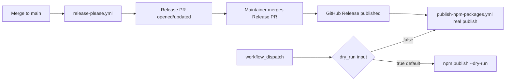

# Publishing `@sutton/*` libraries to NPM

This document describes how shared Digit app-builder libraries leave this monorepo and
land on NPM. **All `@sutton/*` packages publish as public** on [npmjs.com](https://www.npmjs.com/)
(MIT license). The **initial release is `1.0.0`** for all four packages. **Nothing in this
repo publishes automatically until release secrets and org access are configured.**

## Packages

| NPM name | Path | Purpose |
| --- | --- | --- |
| `@sutton/lib-common` | `packages/lib-common` | Error codes, result types, pure validation |
| `@sutton/lib-frontend` | `packages/lib-frontend` | MUI theme, harness types, React data hooks, error UI |
| `@sutton/lib-backend` | `packages/lib-backend` | Worker handler helpers, env/secrets, jobs, webhooks |
| `@sutton/lib-build` | `packages/lib-build` | `digit-app pack` CLI and shared Vite configs |

Dependency graph:

```
lib-common (no internal deps)
    ↑
lib-frontend, lib-backend
lib-build (standalone tooling)
```

## Versioning — Release Please (manifest mode, grouped)

We use [Release Please](https://github.com/googleapis/release-please) in **manifest mode**
(same family of tooling used on `digit-api`):

- `release-please-config.json` — per-package release settings, plugins, and grouped release PR title
- `.release-please-manifest.json` — last released version for each package path

**Grouped versioning (decided):** all four `@sutton/*` packages share **one semver** and bump
together. Release Please uses the `node-workspace` plugin (updates local dependency refs in
`package.json`) plus the `linked-versions` plugin (group `@sutton/libraries`) so
`lib-common`, `lib-frontend`, `lib-backend`, and `lib-build` always release at the same
version (for example `1.2.0` on all four).

On every push to `main`, the `release-please` workflow opens or updates a **single Release PR**
that bumps all linked versions, updates changelogs, and refreshes the manifest. Merging that PR
creates GitHub releases and tags (for example `lib-common-v1.2.0`, all at the same version).

Commit messages on `main` should follow [Conventional Commits](https://www.conventionalcommits.org/)
so Release Please can infer semver bumps (`feat:` → minor, `fix:` → patch, `feat!:` / `BREAKING CHANGE:` → major).

### Why Release Please (vs alternatives)

| Option | Fit for this repo |
| --- | --- |
| **Release Please (chosen)** | Already familiar on `digit-api`; manifest mode with `node-workspace` + `linked-versions` keeps all four `@sutton/lib-*` packages on one shared semver; generates changelogs and a single release PR with no manual version edits. |
| Changesets | Excellent for independent per-package semver, but adds author overhead (changeset files on every PR) and a second merge step. Not needed now that grouped versioning is decided. |
| Manual tags + `npm version` | Minimal tooling, but error-prone in a monorepo and no changelog discipline. |
| Lerna / Nx release | Heavier infra than needed for four small packages with no build graph orchestration beyond `npm run build:packages`. |

## Publish workflow (release time only)

The `publish-npm-packages` workflow is **not** wired to run on every merge. It runs when:

1. A GitHub **Release** is published (typically by Release Please after the Release PR merges), or
2. A maintainer triggers **workflow_dispatch** (defaults to `dry_run: true`).

Steps:

1. Install dependencies from the repo root (`npm ci`).
2. `npm run build:packages` — compile TS libraries to `dist/` (`lib-build` ships plain JS from `src/`).
3. `npm run verify:packages` — smoke-test that `hello-world` still packs.
4. For each package under `packages/*` with a `"name": "@sutton/..."`:
   - `npm publish --dry-run --access public` when `dry_run=true`
   - `npm publish --provenance --access public` when `dry_run=false`

Scoped packages require an explicit `--access public` on first publish (also set in each
package's `publishConfig.access`). CI and local dry-runs use the same flag so publish
behavior matches release time.

### Who triggers publish?

| Step | Actor |
| --- | --- |
| Day-to-day merges to `main` | Release Please bot (opens Release PR only) |
| Merge Release PR | Maintainer (creates GitHub release + tag) |
| NPM publish | GitHub Actions on `release: published`, using `NPM_TOKEN` |

Use workflow_dispatch with `dry_run: false` only for emergency republish/debug after the
Release exists.

## NPM org and `NPM_TOKEN` setup (runbook)

**Status:** documented — **awaiting Sean to provision**. This repo does not include credentials
and the `@sutton` npm organization may not exist yet. Follow the steps below before the first
real publish.

### 1. Create or claim the `@sutton` npm organization

| Item | Guidance |
| --- | --- |
| **Who should own it?** | **Recommendation:** a shared npm user or billing account owned by Digit engineering (e.g. `digit-engineering@…` or an existing platform admin), not an individual developer laptop account. **Placeholder if unknown:** assign an **npm org Owner** (Sean or delegated platform admin) to create the org and invite maintainers. |
| **Create the org** | Log in at [npmjs.com](https://www.npmjs.com/) → avatar → **Add an Organization** → choose the **free** plan unless npm Teams is required → set the org slug to **`sutton`** (publishes as `@sutton/…`). |
| **Confirm the slug** | After creation, the org URL should be `https://www.npmjs.com/org/sutton`. If `@sutton` is already taken by someone else, stop and pick a different scope — **do not change package names in this repo without a product decision.** |
| **Membership** | Add at least two **Owners** or **Admins** (bus factor). Developers who only need to publish from CI do **not** need personal publish tokens once `NPM_TOKEN` is in GitHub. |
| **2FA** | Enable **two-factor authentication** on all owner accounts (npm requires this for publishing). |

### 2. Create an automation token with publish access

Use a **Granular Access Token** (preferred) or an **Automation** classic token for CI.

#### Option A — Granular Access Token (recommended)

1. npm → avatar → **Access Tokens** → **Generate New Token** → **Granular Access Token**.
2. **Token name:** e.g. `github-digit-apps-starter-publish`.
3. **Expiration:** set a rotation policy (e.g. 90 days) or maximum allowed; calendar a renewal.
4. **Permissions:**
   - **Organizations:** select **`sutton`** → **Read and write** (or **Publish** if shown).
   - **Packages and scopes:** limit to **`@sutton/*`** with **Read and write** if the UI allows scope restriction.
5. **Bypass 2FA for automation:** allow only if npm presents this option for granular tokens used in CI (required for unattended publishes).
6. **Generate** → copy the token once (`npm_…`). Store it only in GitHub Secrets — never commit it.

#### Option B — Classic Automation token

1. npm → **Access Tokens** → **Generate New Token** → **Classic Token** → type **Automation**.
2. Scope: publish access to the `@sutton` org (automation tokens are publish-oriented and bypass 2FA for CI).
3. Copy and store in GitHub Secrets only.

**Minimum capability:** the token must be able to `npm publish` all four packages:

- `@sutton/lib-common`
- `@sutton/lib-frontend`
- `@sutton/lib-backend`
- `@sutton/lib-build`

**Verify locally (optional, on a maintainer machine):**

```bash
export NPM_TOKEN="npm_…"   # paste once; do not commit
npm whoami --registry=https://registry.npmjs.org
npm publish --dry-run --access public -w @sutton/lib-common
```

### 3. Add `NPM_TOKEN` to GitHub

| Setting | Value |
| --- | --- |
| **Secret name** | `NPM_TOKEN` (must match [`.github/workflows/publish-npm-packages.yml`](../.github/workflows/publish-npm-packages.yml) — workflow maps it to `NODE_AUTH_TOKEN`) |
| **Secret value** | The npm token from step 2 |

**Where to store it:**

| Location | When to use |
| --- | --- |
| **Repository secret** (default) | `Digit-Technologies/digit-apps-starter` → **Settings → Secrets and variables → Actions → New repository secret**. Sufficient for this repo alone. |
| **Organization secret** | If multiple Digit repos will publish `@sutton/*`, create an org secret and allow access to selected repositories. |
| **Environment secret** (optional hardening) | Create a GitHub Environment (e.g. `npm-publish`) with **Required reviewers** and put `NPM_TOKEN` there; then add `environment: npm-publish` to the publish job. **Not configured in this PR** — recommended before enabling real publishes. |

**Do not** use repository **Variables** for the token (variables are not secret). No other secrets are required for publish today.

### 4. Publish workflow gates (dry-run vs real)

Two workflows chain together; only the second touches npm.



| Trigger | Workflow | `DRY_RUN` | npm registry |
| --- | --- | --- | --- |
| Push to `main` | `release-please.yml` | n/a | **No publish** — opens/updates Release PR only |
| Merge Release Please PR | `release-please.yml` (via GitHub Release) | n/a | Creates GitHub Release + tags; **does not** publish to npm by itself |
| **`release: published`** | `publish-npm-packages.yml` | `false` | **Real publish** — requires `NPM_TOKEN` |
| **`workflow_dispatch`** (default) | `publish-npm-packages.yml` | `true` | **Dry-run only** — safe to run without `NPM_TOKEN` |
| **`workflow_dispatch`** (`dry_run: false`) | `publish-npm-packages.yml` | `false` | **Real publish** — emergency/debug; requires `NPM_TOKEN` |

**Recommended validation order after adding `NPM_TOKEN`:**

1. Actions → **Publish NPM packages** → **Run workflow** → leave **dry_run: true** → confirm build + dry-run passes.
2. Merge the first Release Please PR (or publish a GitHub Release manually for bootstrap) → confirm **`release: published`** job succeeds and packages appear on npm.

**Release Please gate:** day-to-day feature merges do **not** publish. Only merging the **Release PR** (or an explicit GitHub Release) triggers a real npm upload.

### 5. First-publish checklist

Complete before merging the first Release Please release or running `workflow_dispatch` with `dry_run: false`:

- [ ] `@sutton` npm org exists; owners/admins invited; 2FA enabled
- [ ] Org slug confirmed (`https://www.npmjs.com/org/sutton`) — package scope matches repo (`@sutton/lib-*`)
- [ ] No conflicting packages already published under the same names (check npm search / `@sutton/lib-common`)
- [ ] Granular or Automation token created with **publish** rights to `@sutton/*`
- [ ] GitHub **`NPM_TOKEN`** secret set on `digit-apps-starter` (or org/environment per step 3)
- [ ] **Dry-run workflow** green (`workflow_dispatch`, `dry_run: true`)
- [ ] All four `package.json` files at intended version (**`1.0.0`**) and `.release-please-manifest.json` aligned
- [ ] **`publishConfig.access: "public"`** present on each package (already in repo)
- [ ] CI uses **`npm publish --access public`** (already in workflow — required for scoped first publish)
- [ ] **Provenance:** workflow passes `--provenance` and sets `id-token: write`; confirm npm org allows provenance for GitHub Actions (npm → org → publishing settings). If provenance fails on first run, check npm docs for [trusted publishing](https://docs.npmjs.com/generating-provenances) — OIDC can replace long-lived tokens later
- [ ] Post-publish: verify `npm view @sutton/lib-common version` and install smoke test from a clean directory
- [ ] Phase 1 vendoring unchanged — apps still work if npm is down (see phased cutover below)

### Optional hardening (later)

- GitHub **Environment** `npm-publish` with required reviewers on the publish job
- npm **trusted publishing** (OIDC) linked to `Digit-Technologies/digit-apps-starter` to retire long-lived `NPM_TOKEN`
- Token rotation calendar reminder before granular token expiry

## Local dry-run

```bash
npm ci
npm run build:packages
npm publish --dry-run --access public -w @sutton/lib-common
npm publish --dry-run --access public -w @sutton/lib-frontend
npm publish --dry-run --access public -w @sutton/lib-backend
npm publish --dry-run --access public -w @sutton/lib-build
```

## Phased vendoring cutover (proposal for review)

Today, `digit-app pack` copies `@sutton/lib-*` (and legacy `@digit/lib-*`) into
`project/packages/` inside every `app.zip`. Registry publish does **not** require an immediate
stop to vendoring. The plan below is a **proposal for Sean to review** — no phase dates or
stop-at-first-publish assumption.

### Risks to manage across all phases

| Risk | Mitigation |
| --- | --- |
| **Version skew** — vendored copy in zip ≠ semver in `package.json` | Grouped `@sutton/*` releases (one shared version); in Phase 2+, pack should pin vendored copies to the same version as registry deps when both paths exist |
| **Dual-publish drift** — starter zip, Studio, and NPM disagree on lib versions | Record `starterRelease` / app manifest lib version; smoke-test pack after each `@sutton` release |
| **Offline / air-gapped zip rebuild** — no registry in some agent sessions | Keep vendoring through Phase 2; only remove in Phase 3 when consumers can install from NPM |
| **Breaking changes** — app pinned to old vendored libs while registry moved on | Semver + changelog on Release PR; major bumps require explicit Studio/template updates |

### Phase 1 — Registry live, vendoring unchanged (default after first publish)

**Goal:** `@sutton/*` exists on NPM at the grouped semver (starting **1.0.0**); generated apps
still get vendored libs in `app.zip` exactly as today.

| | |
| --- | --- |
| **Pack behavior** | Continue copying all depended `@sutton/lib-*` (+ `lib-build`) into `project/packages/` |
| **App `package.json`** | Examples / starter still use `file:../../packages/...` in monorepo; published apps keep vendored `file:./packages/...` after pack |
| **Optional dual-path** | Early adopters may add registry semver ranges in source *before* pack (allowlist / feature flag in Studio) — pack still vendors for zip portability unless explicitly opted out |
| **Success criteria** | `npm publish` dry-run green; `npm run verify:packages` passes; at least one manual install of `@sutton/lib-frontend@1.0.0` from npmjs.com in a clean project |
| **Rollback** | Unpublish is not reliable on NPM — rollback = publish a patch release or document “do not use” version; vendoring path unchanged so apps keep working without registry |

### Phase 2 — Registry-first templates, vendored fallback

**Goal:** New apps and Digit Studio scaffolds declare **`@sutton/*` semver ranges** (e.g.
`"@sutton/lib-frontend": "^1.0.0"`) as the source of truth; pack still vendors matching
versions into the zip for offline re-pack and agent iteration.

| | |
| --- | --- |
| **Templates / skill** | `create-digit-app` skill + `examples/*` + starter `apps/app` use registry semver in `package.json` (not `file:` to monorepo packages) |
| **Pack behavior** | Resolve registry version at pack time (or pin to lockfile), **then** copy those exact versions into `project/packages/` so vendored tree matches declared semver |
| **Starter zip** | May still ship `packages/` source for monorepo dev, but consumer apps target NPM |
| **Success criteria** | Fresh scaffold → `npm install` → `npm run pack` with no monorepo `file:` links; vendored folders in zip match `package-lock.json` / pinned `@sutton/*` versions; Studio builder session smoke test |
| **Rollback** | Revert templates to `file:` / full vendoring-only deps; pack ignore registry resolution flag |

### Phase 3 — Stop bundling vendored libs into `app.zip`

**Goal:** `project/` inside `app.zip` contains source + tooling only; libs come from NPM at
Digit deploy or agent restore time.

| | |
| --- | --- |
| **Pack behavior** | Stop copying `project/packages/`; `package.json` + lockfile (or shrinkwrap) list `@sutton/*` registry deps only |
| **Prerequisites** | Digit Studio and starter consumers install from NPM in the harness; migration note for existing apps (“re-pack with registry deps”); network/registry available in builder sessions |
| **Success criteria** | `app.zip` has no `project/packages/lib-*`; unpack → `npm ci` → `npm run pack` succeeds; no duplicate React/MUI from vendored + hoisted installs |
| **Rollback** | Re-enable Phase 2 vendoring in `lib-build` behind a manifest or pack flag (`"vendorLibs": true`) until all active apps migrate |

### What stays open (not decided in this PR)

- **Phase timing and gates** — proposal only; Sean to confirm when to enter Phase 2 / 3

## Production-readiness checklist

- [ ] **NPM org + `NPM_TOKEN`** — [setup runbook documented](#npm-org-and-npm_token-setup-runbook); awaiting Sean to provision
- [x] **Public** package visibility on npmjs.com (decided)
- [x] **Initial semver baseline `1.0.0`** for all four packages (decided)
- [x] **Grouped versioning** — one shared semver across all four packages via `linked-versions` (decided)
- [ ] Breaking-change policy documented for app authors
- [ ] Changelog review gate on Release PR merges
- [ ] CI test gate before publish (pack smoke test today; add unit tests if/when added)
- [ ] npm provenance enabled (workflow uses `--provenance`; confirm org setting)
- [ ] **Phased vendoring cutover** — proposal documented above; awaiting review (no stop date)
- [ ] Update `create-digit-app` skill and starter asset when Phase 2 begins
- [ ] Dependabot / Renovate for consumer repos after migration
