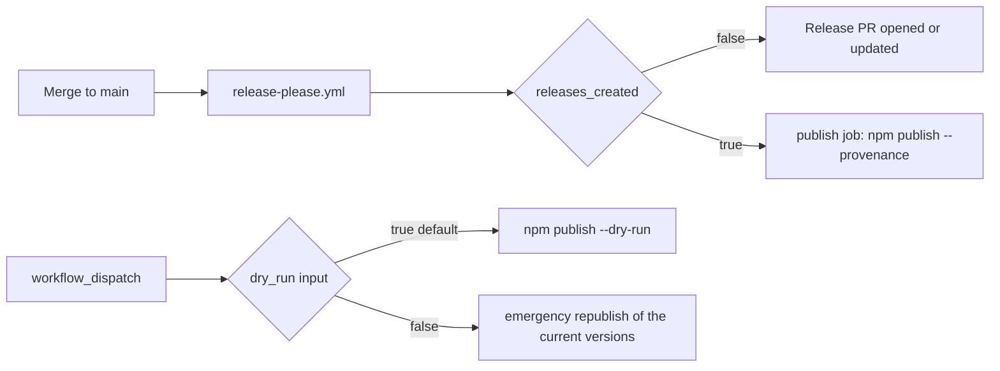

# Publishing `@heysutton/lib-*` from this repo

Platform libraries in this monorepo publish to npm as **public** packages under the
existing **`@heysutton`** org. Theme and UI do not. `@heysutton/ui` is published from
**digit-web**. This repo must not publish it, and it must not grow a second design
system (`Modal`, `InputTextField`, `IconWrapper`, `InvisibleButton`).

Nothing here publishes on an ordinary push to `main`. npm publish runs only when a
**Release Please release PR merges** and that workflow's `releases_created` output is
`true`.

This is separate from:

- the curated starter zip (`publish-starter-asset.yml`, tags `starter-*`)
- digit-web app deploy
- `@heysutton/ui`

## What Sean still wires

The `@heysutton` npm org already exists. This repo does not store a token. Before the
first real publish, add a GitHub Actions secret on `Digit-Technologies/digit-apps-starter`:

| Secret | Value |
| --- | --- |
| `NPM_TOKEN` | Granular or classic Automation token that can publish `@heysutton/lib-common`, `@heysutton/lib-frontend`, `@heysutton/lib-backend`, and `@heysutton/lib-build` |

The publish job maps `NPM_TOKEN` to `NODE_AUTH_TOKEN` and **fails closed** when it is
empty. It also sets `id-token: write` and runs `npm publish --provenance --access public`.
Without `id-token: write`, provenance cannot mint the Actions OIDC token and the first
real publish fails.

Trusted publishing (npm OIDC, no long-lived token) is optional later. The job is not
switched to it yet. Provenance still needs `id-token: write` either way.

Do not create a token or workflow for `@heysutton/ui` in this repository.

## Packages

| NPM name | Path | Publishes |
| --- | --- | --- |
| `@heysutton/lib-common` | `packages/lib-common` | Error codes, result types, pure validation |
| `@heysutton/lib-frontend` | `packages/lib-frontend` | Host bridge, API hooks, `AppErrorAlert`. `DigitThemeProvider` is a temporary re-export, not the design-system source of truth |
| `@heysutton/lib-backend` | `packages/lib-backend` | Worker handlers, env/secrets, jobs, webhooks |
| `@heysutton/lib-build` | `packages/lib-build` | `digit-app pack` CLI and shared Vite configs |

Not published from here: `@heysutton/ui`, theme tokens as their own package, Modal wrappers.

`lib-frontend` and `lib-backend` depend on `@heysutton/lib-common` at a plain version
(`"1.0.0"` at bootstrap). npm workspaces link that local package because the version
matches. Do not put `file:` or `workspace:` in those published dependency fields.

Starter apps and examples keep `file:` dependencies. `digit-app pack` vendors
`@heysutton/lib-*` and still accepts the legacy `@digit/lib-*` alias. It does not vendor
`@heysutton/ui`.

## Versions

[Release Please](https://github.com/googleapis/release-please) manifest mode, one group:

- `release-please-config.json` — `node-workspace` (`merge: false`) plus `linked-versions` group `@heysutton/libraries`
- `.release-please-manifest.json` — last released version for each package

`lib-common`, `lib-frontend`, `lib-backend`, and `lib-build` share one semver. Package
versions and the manifest start at **`1.0.0`**. Merging the setup PR does not publish
and does not open a release (its commit is `ci:` / docs, which Release Please does not
bump). The next `feat:` or `fix:` commit on `main` opens one release PR titled
`chore: release @heysutton libraries …`. Merging **that** PR publishes.

Conventional Commits drive the bump (`feat:` minor, `fix:` patch, `feat!:` / `BREAKING CHANGE:` major).

To put the `1.0.0` baseline on npm before any bump, run **Publish NPM packages** with
`dry_run: false` after `NPM_TOKEN` is set. Later versions should go through the release PR.

## Cadence


```mermaid
flowchart LR
  merge[Merge to main] --> rp[release-please.yml]
  rp --> gate{releases_created}
  gate -->|false| rpr[Release PR opened or updated]
  gate -->|true| pub["publish job: npm publish --provenance"]
  manual[workflow_dispatch] --> dry{dry_run input}
  dry -->|true default| dryRun[npm publish --dry-run]
  dry -->|false| emergency[emergency republish of the current versions]
```

| Trigger | What happens on npm |
| --- | --- |
| Push or merge to `main` that does not create a release | No publish. Release Please may open or update the release PR. |
| Merge the Release Please release PR | Same workflow publishes all four `@heysutton/lib-*` packages. `releases_created == 'true'`. |
| `workflow_dispatch` on Publish NPM packages, `dry_run: true` (default) | Dry-run only. No token required. |
| `workflow_dispatch` with `dry_run: false` | Real publish. Requires `NPM_TOKEN`. Use for the 1.0.0 baseline or an emergency republish. |

A `release: published` workflow will not run. Release Please creates the GitHub Release
with `GITHUB_TOKEN`, and GitHub does not start workflows from events that token
produces. Publish is a second job in [`.github/workflows/release-please.yml`](../.github/workflows/release-please.yml).

Library tags look like `lib-common-v1.2.0`. They must not replace the starter zip at
`/releases/latest`. After Release Please creates those GitHub releases, the workflow
marks the newest `starter-*` release latest again. The starter asset workflow still
passes `--latest` when it publishes a new zip.

## Build

TypeScript packages compile to `dist/` (`npm run build:packages`). `@heysutton/lib-build`
ships `src/`. Root `prepare` runs the build on `npm install`, including in a downloaded
starter zip, so `digit-app pack` can resolve `dist/`.

`files` for the TypeScript packages is `dist` plus `README.md`. The published
`@heysutton/lib-frontend` tarball includes the temporary theme code only because
`DigitThemeProvider` is still re-exported. The export map is the package root. Do not
add a `./theme` entry or a second package.

## Local check

```bash
npm ci
npm test
npm run build:packages
npm run verify:packages
npm publish --dry-run --access public -w @heysutton/lib-common
npm publish --dry-run --access public -w @heysutton/lib-frontend
npm publish --dry-run --access public -w @heysutton/lib-backend
npm publish --dry-run --access public -w @heysutton/lib-build
```

Pull requests run [`.github/workflows/test-packages.yml`](../.github/workflows/test-packages.yml)
(`npm test`, build, and `npm publish --dry-run`).
